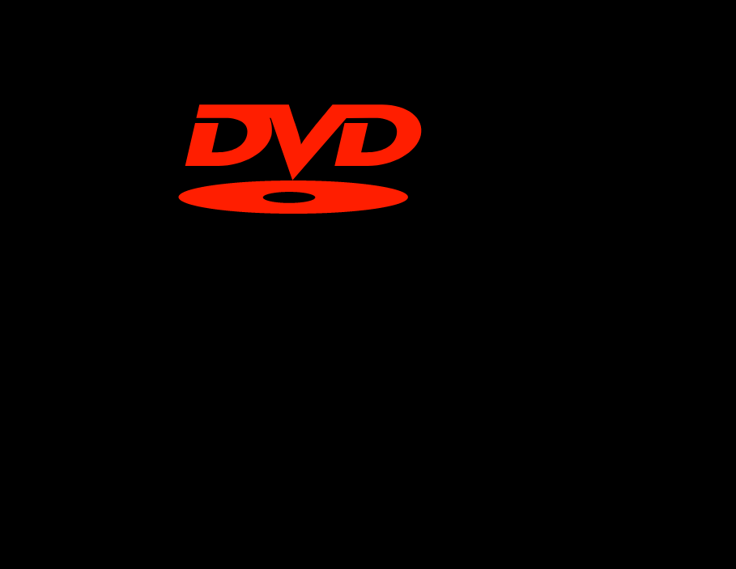

# dvd-screensaver
The old dvd-player screensaver rebuilt from scratch using vanilla JS

Decided to make a demo to learn how animating html elements works using vanilla JavaScript. 
What more fitting of a task is it then to recreate the old dvd-screensaver. Retro is cool now right?

<<<<<<< HEAD
Docker: 🐳
```
❯ docker build -t dvd-screen-nginx .
❯ docker run --name dvd-screen-nginx -d -p 8080:80 dvd-screen
```
=======
Screenshot:

>>>>>>> eda99ed48cab9018749741d42a09f8cf697432f0
